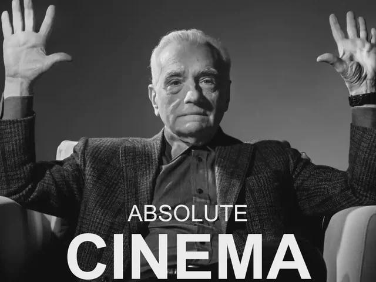

Man, this album is awesome, but in the weirdest way.

I'll admit that I spent many years as a pretty harsh skeptic when it came to ZZ Top. My first exposure to this band was the opening of the TLC reality show Duck Dynasty, which I've always disliked. That distaste carried over to ZZ Top as a whole just by association, which was a viewpoint I didn't get around to properly scrutinizing for at least five years.

For those fortunate enough to not be familiar, Duck Dynasty is complete trash television. Like everything else on TLC, it's just bucket after trough after school cafeteria tray of trite, lowest-common-denominator slop. We're talking solid red state, public high school, district-ran-out-of-money-for-copy-paper cafeteria trays.

Once I was in my early twenties, I took a second look at ZZ Top in an attempt to square the association with a crap TV show with my dad's insistence that they were the cat's ass. To my surprise, when I looked again with fresh eyes (listened again with fresh ears?) I ended up liking what I saw. Heard. Whatever.

I filed that knowledge away, where it sat for another few years until I was at a record shop last week. They had a copy of Eliminator on tape. When I looked closer, I saw Gimme All Your Lovin' and Sharp Dressed Man on the label. I was sold.

When I played it, I was stumped. The first few tracks on side A kicked ass. The rest of side A was good, but not as great. Side B continued to gradually deflate right up until the album ended without fanfare.

...what?

It feels like this album is arranged backwards!

I don't mean to say that the first few songs are the only ones worth listening to by any means. Thug and TV Dinners are pretty bland and repetitive, but everything else is absolutely worth your time. The problem is that, by virtue of their position on the track list, they have to follow Gimme All Your Lovin' (track 1) and Sharp Dressed Man (track 3). Those are two of the all-time best songs that ZZ Top ever put out, so you can imagine how that went. I Got the Six makes a valiant effort, but it's just not enough.

What you're left with is an album with a bunch of standout material that deals a terrible hand to its second line, in hockey terms. As a whole, though, I'd still recommend it. There's even some lyrical genius sprinkled in there:

> 🎵*She likes whips and chains*🎶

> 🎵*She likes cocaine*🎶

> \- *Got Me Under Pressure*

Musically, this album is like white chocolate. It takes clear influence from the blues, which is dark chocolate in this analogy, but it drops the syncopated rhythm and melancholic emotional tone as white chocolate drops the cocoa. The result is a little flatter and lacks that bitter twist that creates a complex experience on the palate. It's still tasty, but it's not really chocolate anymore. It's still a good album, but it's something entirely distinct from the blues.

Since I was an idiot teenager, I've learnt a few important things. First of all, Duck Dynasty really does suck just as hard as I thought it did. Secondly, that show is still somehow better than most of TLC's catalogue. Most importantly, ZZ Top put out some absolute bangers. I had a terrible first impression, and my brain was doing the best it could while running on red state public high school cafeteria food - yes, we actually did run out of money for paper one year - I was wrong to let that show sour me on this band.

### Is this album worth owning on physical media?

Totally. It's worth owning just for those two standout tracks I mentioned before. Those two were later made into singles, so if you think of it as buying those and getting the rest of the album as a bonus, you'll be very happy.

### Is this album worth a stream?

For sure. Don't be ashamed of skipping a track or two when the album wanders into the doldrums. For the best experience, listen to the whole thing in reverse order.

### Is this album worth what I paid for it?

I paid six bucks for this album in used condition. That's what you'd pay for a cheap beer on a night out. If one cheap beer is worth more to you than this album, choosing the music is the absolute least of your problems for the drive home.