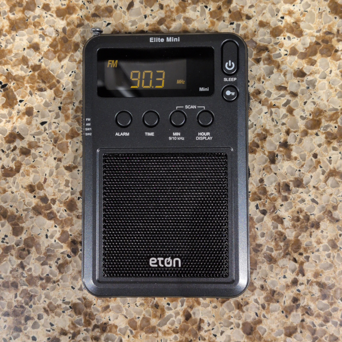
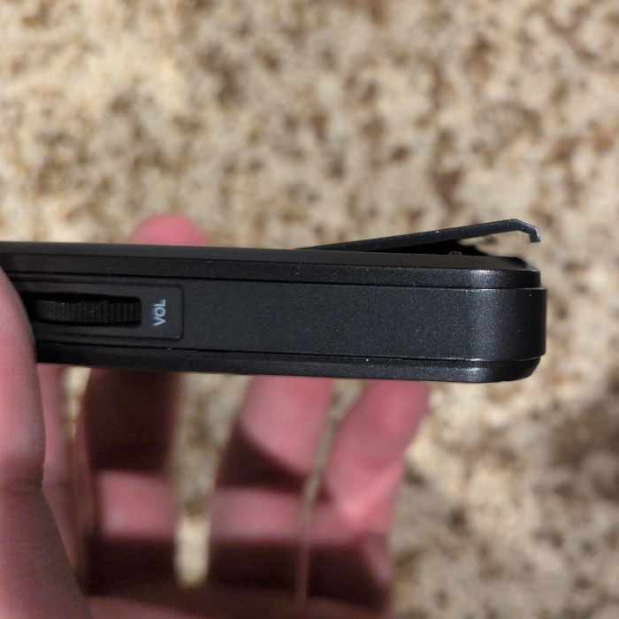
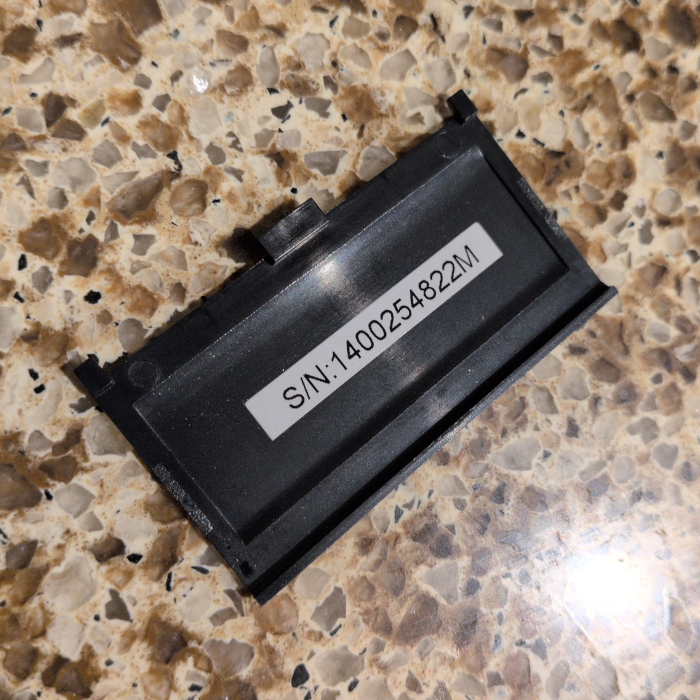
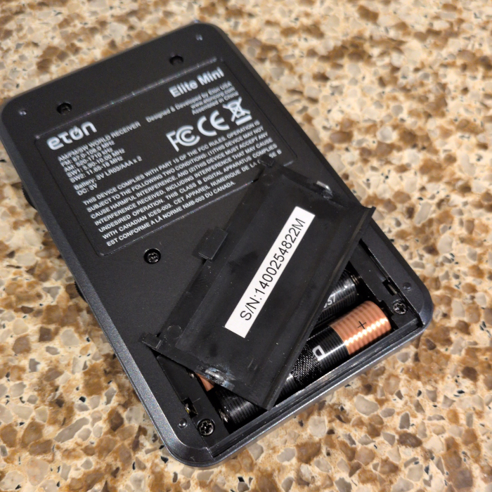
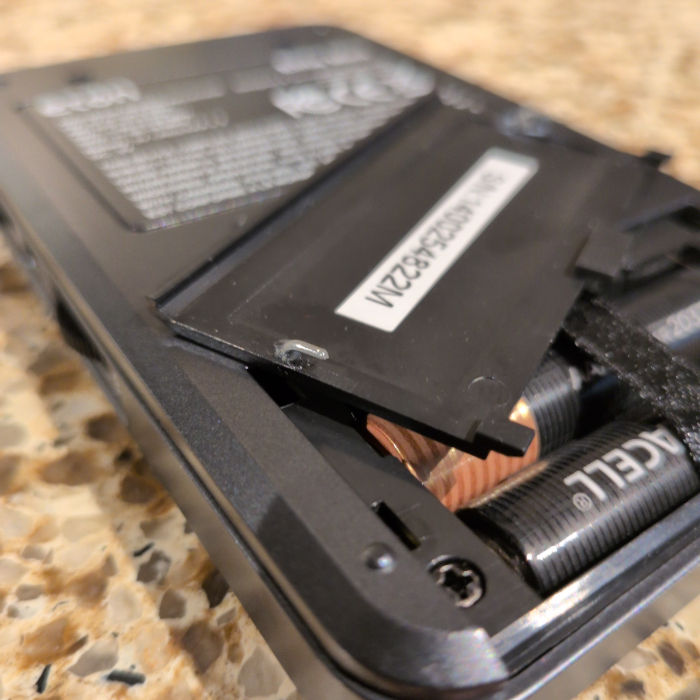
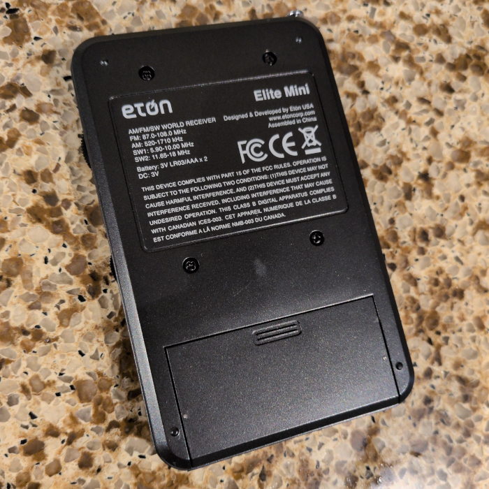

A while ago, I picked up this pocket radio on eBay. I pulled the trigger because I read good things about the sound quality (at least when using headphones) and I really liked its slim design. I got it for $25 used.

Disappointingly, but unsurprisingly by now, the seller failed to mention that the battery door was broken. It would slide on, but the little retaining hooks that would actually hold it against the case were completely broken off. It would just hang off the back of the case while in the closed position. If you've read my post about repairing a Sony WM-FX707, you may begin to see a pattern with respect to my luck with both battery doors, and with eBay for that matter. 

Naturally, the first thing I did was get a partial refund from the scumbag seller. I could’ve called it quits there, complained to eBay to get all my money back, and binned this thing, but that’s no fun. Instead, I hatched a scheme to fix this battery door myself with whatever tools and materials I had on hand that afternoon. 

That “tools and materials on hand” thing is very much a load-bearing clause in this case, as I’m not the kind of nerd who has fancy tools like a 3D printer at his disposal. That put re-creating the whole cover from scratch out of the question. Instead, I decided to find some way to replace those missing plastic hooks on the original battery door. I went digging around in my desk drawers and eventually assembled a ragtag team of household crap that showed some promise: a paperclip, a Dremel with a kit of tiny drill bits, a wire cutter/stripper, super glue, and RTV silicone adhesive. The idea was that I’d bend and cut the paperclip to make replacement hooks, drill holes in the battery cover where the original hooks attached, and then secure the hooks into those holes with the adhesives. I didn’t know which adhesive to use, so I used one for each hook. In the event that one bond failed, I’d just re-glue it with the other adhesive. 

Drilling the holes was relatively easy. I just put the old cover on a stack of cardboard scrap and drilled the holes in the middle of where the old hooks used to attach. I used a 1/32” bit as its thickness roughly matched the paperclip’s when I eyeballed it. Bending the paperclip was also easy, as the tips of my wire strippers are square-nosed pliers, so I used them to hold the paperclip and got two clean 90-degree bends. 

Cutting them to the right size was tougher, as paperclips don’t cut easily and the length took some trial and error to dial in, but I eventually got it sorted out after a couple of test fits. The last thing to do was to glue them in place. These parts were about the size of a grain of rice, so it took some delicate tweezer manoeuvring, but I eventually had them glued and seated. Here’s how they look after I left them to cure for a day:

After using the radio for a few weeks and changing the batteries a few times, I’m happy to report that both adhesives have proven reliable so far. In all, this repair took me about 60-90 minutes to do and cost me a grand total of $0. I’m glad that the repair is visible from the outside thanks to those exposed paperclip ends that sit flush to the exterior. 

It’s satisfying to look at those and know that I saved something from a landfill. The fact that I can sell it as a fully working device instead of a partially broken one (in good conscience!) is nice too. 

Go fix something today!